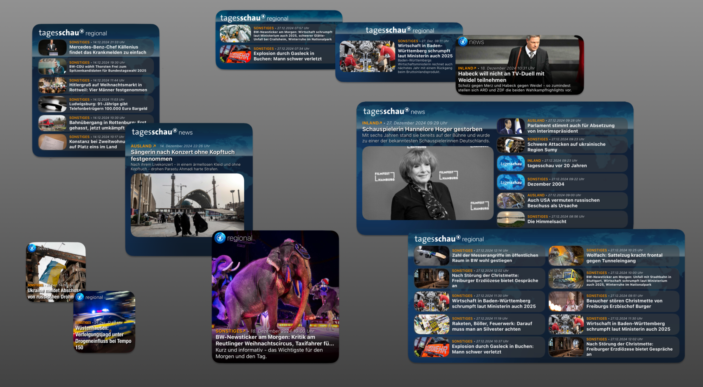
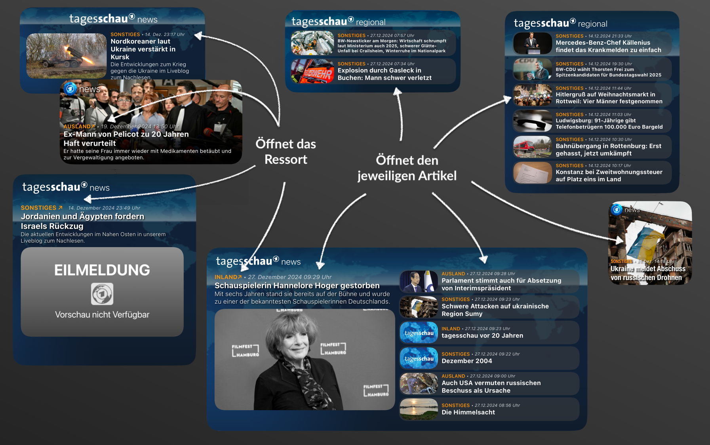
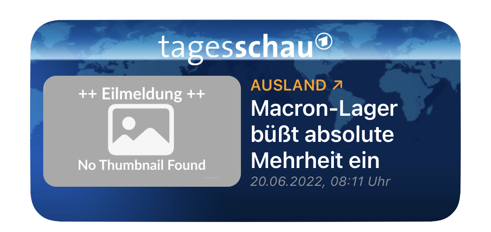
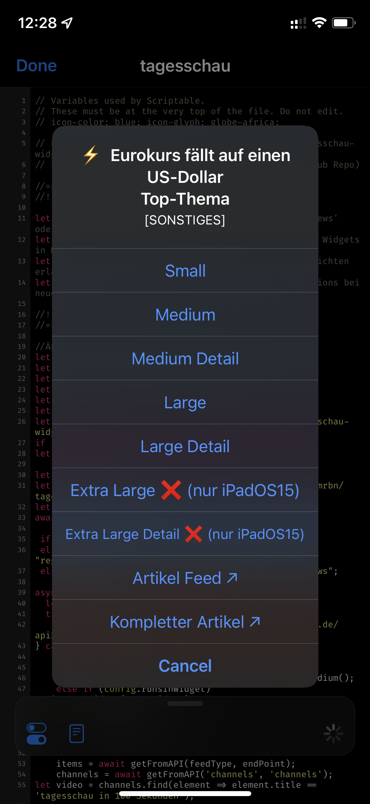
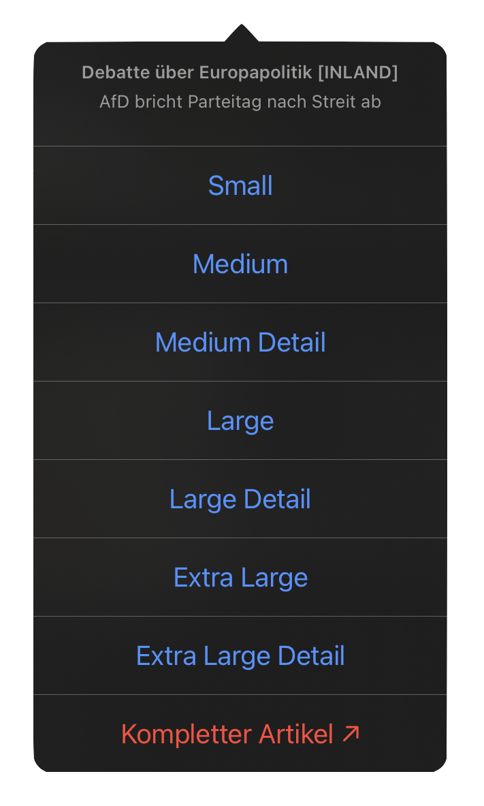
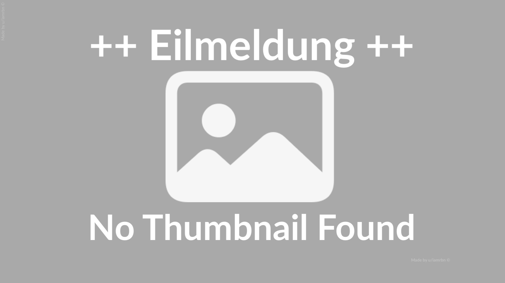
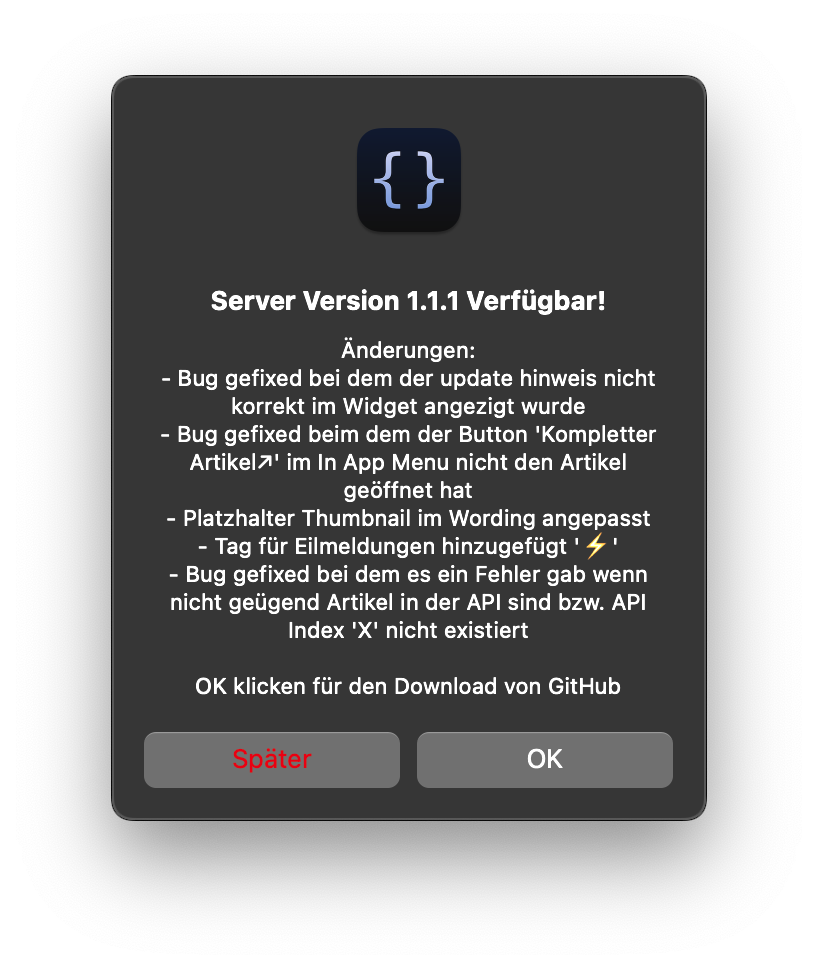

#  tagesschau-widget for Scriptable
Based on this [reddit post](https://www.reddit.com/r/Scriptable/comments/jm17ra/tagesschaude_widget/?utm_source=share&utm_medium=web2x&context=3) of [u/trbn_hck](https://www.reddit.com/user/trbn_hck/)    
Unfortunately the [Repositorie](https://github.com/trbnhck/scriptable-scripts/tree/main/tagesschau-widget) in his [GitHub profile](https://github.com/trbnhck) is no longer exist.  


## Widget übersicht 👀


<br>

## Features ✨

### Verfügbare widget größen
- small
- medium [detail & list view]
- large [detail & list view]
- extra large [detail & list view] (iPadOS15 und höher)

<br>

### Klickbare Elemente



Bei den "detailview" Widgets ist ausschließlich das Titelbild klickbar und führt zum entsprechenden Artikel.
Zudem sind in den "detailview" Widgets die **Ressort** Tags Klickbar und führen zur entsprechenden Ressort Übersicht (_Ausgenonnem ist "Sonstiges"_)
Bei den "listview" bzw. normalen widgets ist der komplette jeweilige "Stack" (_graue hintergrund_) klickbar. 

<br>

### No Thumbnail Found ++ Eilmeldung ++
Sollte es noch oder überhaupt kein Titelbild zu einem Artikel geben (_Grund Eilmeldung_) so wird ein Platzhalter verwendet.

<p align="center">

   </p>

<br>

### Widget Parameter

#### ` app `    
Wenn im jeweiligen Widget Parametern der Begriff "app" eingetragen wird, werden beiträge aus diesem widget beim anklicken in der [tagesschau-app](https://apps.apple.com/de/app/tagesschau-nachrichten/id401644893) geöffnet.
Standard ist der web-browser.

#### ` detailview `    
Beim eintragen des Keywords "detailview" wird der erste Artikel in der Detailansicht präsentiert.

**Wichtig:** Sollten beide optionen gewünscht sein so sollten die jeweiligen Keywords getrennt werden d. h. durch z.B. ein Semicolon `;` (Bsp. `app;detailview`)

<br>

### In App Lauf
Beim starten des Scripts in der App wird als erstes ein Menu angezeigt.     
Dieses zwigt in der Headline den aktuellsten Titel, Topline + Ressort.     
Zudem wird angezeigt ob das `extraLarge Widget` auf dem Gerät unterstützt wird. Voraussetzung ist ein iPad mit iPadOS **15** oder neuer.    
<p align="center">
 
   </p>

<br>

### Erster Lauf
Beim ersten Lauf wird im Scriptable Ordner ein neuer Ordner erstellt mit dem Namen "tagesschau-widget"
In diesem werden die drei unten aufgeführten Bilder abgelegt.

```
iCloud Drive/
├─ Scriptable/
│  ├─ tagesschau-widget/
│  │  ├─ header.png
│  │  ├─ appIcon.png
│  │  ├─ background.png
│  │  ├─ Eilmeldung_NoThumbnailFound.png
```
   

<br>

### Selfupdate Funktion
Das Script verfügt über eine Selbstupdate Funktion.
Der User bekommt nach dem Script Update auf GitHub eine benachrichtigung das es eine neue Version zur verfügung gibt. ([Function](https://github.com/mvan231/Scriptable#updater-mechanism-code-example "GitHub Repo") is written by the amazing [@mvan231](https://twitter.com/mvan231 "Twitter"))
<p align="center">

</p>


<h2 style="font-size:1"
<p align="center" style="font-size:10vw">
   <a href="https://github.com/iamrbn/tagesschau-widget/blob/main/README.md"> ⬆️ Nach Oben Springen </a>
</p>
</h2>


 
<p align="center">
  <a href="https://reddit.com/user/iamrbn/">
    
  </a>
  <a href="https://twitter.com/iamrbn_/">
    
  </a>
</p>
