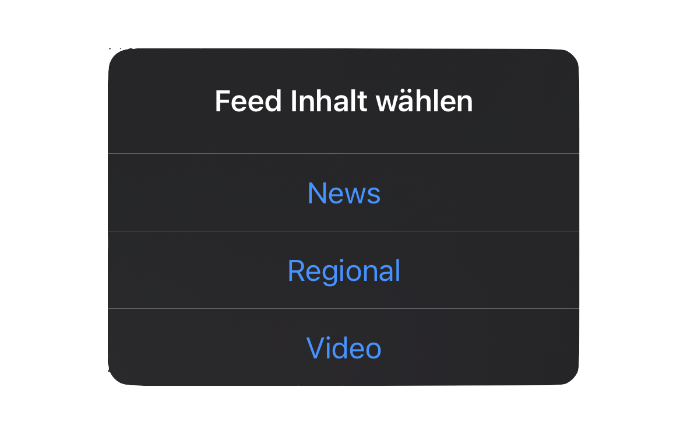

#  tagesschau-widget for Scriptable
Based on this [reddit post](https://www.reddit.com/r/Scriptable/comments/jm17ra/tagesschaude_widget/?utm_source=share&utm_medium=web2x&context=3) of [u/trbn_hck](https://www.reddit.com/user/trbn_hck/)    
Unfortunately the [Repositorie](https://github.com/trbnhck/scriptable-scripts/tree/main/tagesschau-widget) in his [GitHub profile](https://github.com/trbnhck) is no longer exist.  


## Widget übersicht 👀


<br>

## Features ✨

    


### Verfügbare Widget Typen

- Rund lockscreen (Circular Lockscreen Widget)
- Rechteckig lockscreen (Rectangular Lockscreen Widget)
- Small
- Medium [detail & list view]
- Large [detail & list view]
- Extra-Large [detail & list view] (nur iPadOS15 und höher)

<br>
<br>
<br>


### Klickbare Elemente


Bei den "detailview" Widgets ist ausschließlich das Titelbild klickbar und führt zum entsprechenden Artikel.
Zudem sind in den "detailview" Widgets die **Ressort** Tags Klickbar und führen zur entsprechenden Ressort Übersicht (_Ausgenonnem ist "Sonstiges"_)
Bei den "listview" bzw. normalen widgets ist der komplette jeweilige "Stack" (_graue hintergrund_) klickbar. 

<br>

### ++ Eilmeldung ++ No Thumbnail Found
Sollte es noch oder überhaupt kein Titelbild zu einem Artikel geben, so wird ein Platzhalter verwendet um eine Fehlermeldung zu vermeiden.
<p align="center">

   </p>

<br>

### Feed Ansicht
In der Feed Ansicht kann zwischen News, Regional & Video ausgewählt werden.

<p align="center">
   
</p>

Was Ausgewählt wurde wird später im Header angezeigt.
Zudem zeigt der Feed u. a. farblich an ob ein Artikel eine Eilmeldung ist.
Jede einzelne Zeile ist klickbar und führt zum jeweiligen Artikel im In-App Browser.

<p align="center">
 
   </p>


<br>

### Push Notifications
Es kann eingestellt werden ob du Nachrichten über Neue Meldungen und neue Folgen vom "tagesschau in 100 Sekunden" Podcast erhalten möchtest. Das ist pro Gerät einstellbar (_iPhone & iPad_).


<p align="center">
 
   </p>
   
<br>

### Script Settings
Im Script können neben dem erlauben von Push Notifications auch den ungefähren [^1] Refresh Intervall des Widgets einstellen zudem den standard Feed-Typ eingestellt werden.
` news ` oder ` regional `

```javascript
let feedtype = 'regional' //Standard Feed Typ eingeben 'news' oder 'regional' möglich!
let bundesland = 'baden-württemberg' // für alle BL bitte leere hochkommatas ('') verwenden; für mehrere BL diese bitte mit komma getrennt aneinander reihen!

//Refresh Intervall der Widgets/Scripts in Minuten eingeben
var CONFIGS = {
      DEVICES: {
       iPad: {
        enableNotifications: false, //true: Neue Pushnachrichten erlauben; ansonsten 'false'
        tagesschau100sec: false, //true: für Pushnachrichten bei neuer Folge
        refreshInt: 60
       },
       iPhone: {
        enableNotifications: true,
        tagesschau100sec: true,
        refreshInt: 60
       }
     }
};
```

<br>

### Widget Parameter

#### Detailview
Beim eintragen des Keywords `detailview` wird der erste Artikel in der Detailansicht präsentiert.

#### Ressort
Widgets können mit den keywords `news` oder `regional` den jeweilgen Feed anzeigen.

**Wichtig:** Sollten beide optionen gewünscht sein so sollten die jeweiligen Keywords getrennt werden d. h. durch z.B. ein Semicolon ";"    
Bsp. `regional;detailview`
<br>


### Erster Lauf
Beim ersten Lauf wird im Scriptable Ordner ein neuer Ordner erstellt mit dem Namen "tagesschau-widget"
In diesem werden die drei unten aufgeführten Bilder abgelegt.

```
iCloud Drive/
├─ Scriptable/
│  ├─ tagesschau-widget/
│  │  ├─ tagesschauHeader.png
│  │  ├─ appIcon.png
│  │  ├─ appIconRounded.png
│  │  ├─ tagesschauBackground.png
│  │  ├─ placeholderThumbnail.png
│  │  ├─ tagesschau_trademark_monochrLS.png
```
     

<br>

### Selfupdate Funktion
Das Script verfügt über eine Selbstupdate Funktion[^2]. Der User bekommt nach dem Script Update auf GitHub eine benachrichtigung das eine neue Version zur verfügung steht.
<p align="center">

</p>


<h2 style="font-size:1"
<p align="center" style="font-size:10vw">
   <a href="https://github.com/iamrbn/tagesschau-widget/blob/main/README.md"> ⬆️ Nach Oben Springen </a>
</p>
</h2>


 
<p align="center">
  <a href="https://reddit.com/user/iamrbn/">
    
  </a>
  <a href="https://twitter.com/iamrbn_/">
    
  </a>
  <a href="https://mastodon.social/@iamrbn">
    
  </a>
</p>

<br>

___

[^1]:[refreshAfterDate](https://docs.scriptable.app/listwidget/#refreshafterdate "Scriptable Documentation") 

1. ListWidget()     
refreshAfterDate: Date
> The property indicates when the widget can be refreshed again. The widget will not be refreshed before the date have been reached. It is not guaranteed that the widget will refresh at exactly the specified date.

> The refresh rate of a widget is partly up to iOS/iPadOS. For example, a widget may not refresh if the device is low on battery or the user is rarely looking at the widget.    

Source: Scriptable Documentation

[^2]:[Function](https://github.com/mvan231/Scriptable#updater-mechanism-code-example "GitHub Repo") is written by the amazing [@mvan231](https://twitter.com/mvan231 "Twitter")
